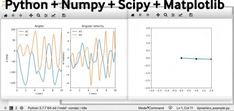

# python_mechanical_engineers
A collection of scripts, functions, links and presentations in Python relevant for the mechanical engineering students

## examples by Avishai Sintov

## Python libraries for Mechanical Engineering
1. https://github.com/osule/mechpy  and the notebook https://github.com/osule/mechpy/blob/master/mechpy.ipynb
2. https://github.com/openpiv/openpiv-python
3. https://github.com/pydy/
4. http://docs.sympy.org/latest/modules/physics/mechanics/index.html

## Tutorials:
3. https://github.com/pydy/pydy-tutorial-human-standing
